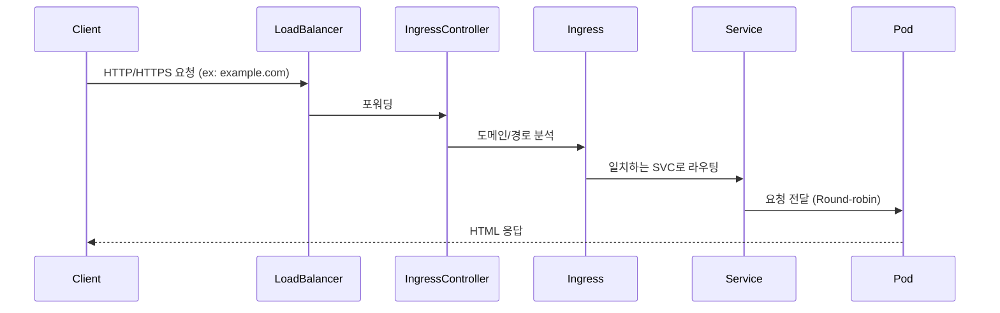

# 🚀 Docker vs Kubernetes: 실전 예시 기반 비교

## 📦 예시: NGINX 웹 서버 3개 복제 + 웹 서비스 노출

---

## 🔸 Docker 환경에서 구성

| 항목 | 설명 |
|------|------|
| 컨테이너 실행 | `docker run -d -p 8081:80 nginx` × 3 |
| 접근 방식 | 각각 다른 포트 (`localhost:8081`, `:8082` 등) |
| 로드밸런싱 | ❌ 수동 포트 설정 필요 |
| TLS 설정 | nginx.conf 직접 수정, 수동 cert 적용 |
| 장애 복구 | ❌ 수동 재시작 필요 |
| 상태 관리 | ❌ 수동 확인 필요 |

---

## 🔹 Kubernetes 환경에서 구성

| 리소스 | 역할 |
|--------|------|
| Deployment | nginx Pod 3개 자동 배포 및 상태 관리 |
| Service (ClusterIP) | Pod들을 하나의 IP로 묶어 로드밸런싱 |
| Ingress + Controller | 도메인 기반 접근 (`example.com`) 제공 |
| PVC | 정적 콘텐츠 스토리지 (필요 시) |
| TLS | Ingress + Secret으로 간편 설정 |
| 장애 복구 | ✅ 자동 복구 (Self-healing) |

---

## ✅ 차이 요약 비교

| 항목 | Docker | Kubernetes |
|------|--------|------------|
| 실행 방식 | 명령어 기반 | 선언형 YAML |
| 복제/확장 | 수동 (`docker run`) | 자동 (`replicas: 3`) |
| 로드밸런싱 | ❌ 없음 | ✅ Service가 자동 분산 |
| TLS 설정 | 복잡 | ✅ 간단 (Secret + Ingress) |
| 장애 복구 | ❌ 수동 | ✅ 자동 복구 |
| 운영 최적화 | 낮음 | ✅ DevOps/확장성 중심 |

---

## 🎯 핵심 정리

| 관점 | Docker | Kubernetes |
|------|--------|------------|
| 목적 | 단일 컨테이너 실행 | 컨테이너 오케스트레이션 |
| 주 대상 | 개발자 | 운영자, DevOps 팀 |
| 확장성 | 제한적 | ✅ 수평 확장, 고가용성 |
| 사용 환경 | 개발/테스트 | 실서비스 운영 환경 |

---

## 🌐 Ingress Controller 포함한 Kubernetes 구성 (Mermaid 다이어그램)

