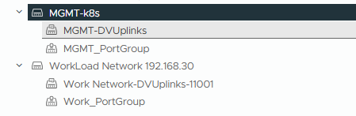

1. 분산 스위치 구성 - Mgmt, Workload (2개의 네트워크 필요)
   - 
2. HAProxy OVA 설치 - mgmt :192.168.0.x, workload : 192.168.30.x
   - HAproxy 가상 IP Pools 설정
   - admin 계정 password 기록
3. Tag 생성 및 스토리지 Tag 할당 - 각 HOST(20,21,22)의 데이터스토어 Tag 할당
   - Datastore Tag는 공유스토리지 연결 또는 모든 HOST의 스토리지 1나를 포함 해야함
4. 워크로드 구성
   - HAProxy Crt 복붙.

```bash
-----BEGIN CERTIFICATE-----
MIID5DCCAsygAwIBAgIJAICNaRkVhjp8MA0GCSqGSIb3DQEBCwUAMG4xCzAJBgNV
BAYTAlVTMRMwEQYDVQQIDApDYWxpZm9ybmlhMRIwEAYDVQQHDAlQYWxvIEFsdG8x
DzANBgNVBAoMBlZNd2FyZTENMAsGA1UECwwEQ0FQVjEWMBQGA1UEAwwNMTkyLjE2
OC4wLjE1MTAeFw0yNTA0MDcwNDExMDVaFw0zNTA0MDUwNDExMDVaMGgxCzAJBgNV
BAYTAlVTMRMwEQYDVQQIDApDYWxpZm9ybmlhMRIwEAYDVQQHDAlQYWxvIEFsdG8x
DzANBgNVBAoMBlZNd2FyZTENMAsGA1UECwwEQ0FQVjEQMA4GA1UEAwwHaGFwcm94
eTCCASIwDQYJKoZIhvcNAQEBBQADggEPADCCAQoCggEBALKg3s7rVsmlHACzQm/g
dBMWZrJRyr2Tok51iCwH+1qSqqQgfpYlk3kn+lycDe3MWDT/eANUWy98dPo0fNLO
915i36jkWdoqLwTqlv7jSOw3Ft7DpyutXWJtqIqKKR4JJ2jZ5OQssZNV046nj46Y
8936CYB6PndfVy5gG4NL1Qf26hoDo8GZT7rr68LYyWa31SlXzRyHybyUlIYaINEQ
Tup4sIUJFZ7etUo9fQMpnoBPdVRi6zQijMhZR/0mvRt6ax3V6d10/oQXJYYSFH/q
JGmbgvgqjuYETpz/LhfM+omnx8VGM64Hg0nSEuKHQqcRDAYkiK9Gr2Mo9TQ4H4pB
qL0CAwEAAaOBijCBhzAJBgNVHRMEAjAAMAsGA1UdDwQEAwIFoDAdBgNVHSUEFjAU
BggrBgEFBQcDAgYIKwYBBQUHAwEwHQYDVR0OBBYEFERRI8lCr0Q2j4+Zb7GNE+cz
2J9rMC8GA1UdEQQoMCaCB2hhcHJveHmCCWxvY2FsaG9zdIcEfwAAAYcEwKgAl4cE
wKgeyTANBgkqhkiG9w0BAQsFAAOCAQEAn4mhfrCVUulXjMR+/V4cr3GfZ5BuAQzQ
8K0x4V/fP2MDrSqlHbQ3TzAUr0LLK4Mkk56SXCh4s/LBc5LNCEbIbVSeJNyYcHko
6Nn2fWxJB8MlkuzAqGmSvkNrp2wRxnVUTLhjx06iJ65CFaWrDkYdRB8S36ehec3J
Ahgap/YNpJkuEQBkaKl50fslK0FINg3UyRWHllNIMMKJuxxbHqbIn5+auWDPiqSh
tYsBnuf3lUyNgW1REg7sFeS8rQoj44OFkVe14S0oFUIEZvjpS5jtCyBwiaIiKN18
sMup+rAVwuAJkL7vQj+Cjqc1bZHAnijDlinfymFUvKyeGJjTOC5nww==
-----END CERTIFICATE-----
```

5.
