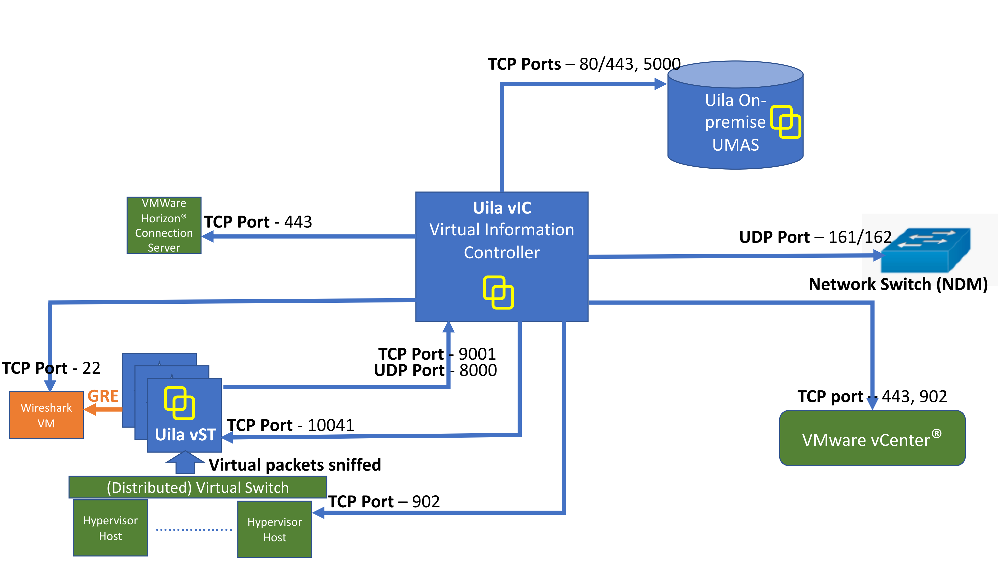

0. 

해당 방화벽 오픈

1. Uila 5.2.0-27 - UMAS, VIC Install
2. OVF -> install
3. DNS
   - uila-umas 192.168.0.137
   - uila-vic 192.168.0.138
4. umas VM Start
   - umas IP 설정 - ID/PW 설정
5. uvic VM start

   - vic IP 설정
   - uila portal (Y/N) -> N 설정
   - Umas IP 입력 umas ID/PW 입력
   - vcenter IP 입력 vcenter ID/PW 입력

6. umas 접속 -> Setting

7. 보고자 하는 가상 스위치에 vST 설치
